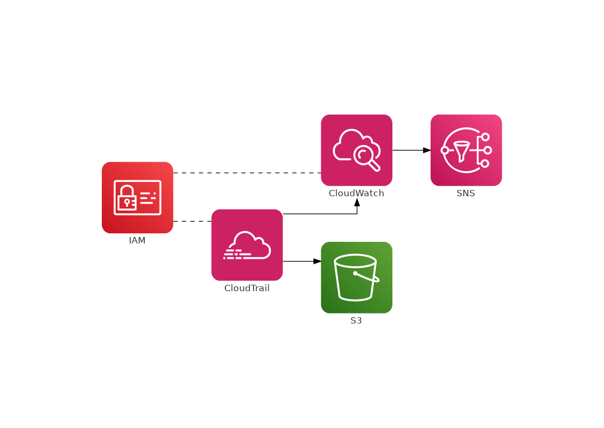

# AWS CloudTrail - CloudWatch - SNS Terraform module

A Terraform module that creates a multi-regional Trail, connects it with a CloudWatch Log Group, and creates a number of metric filters and metric alerts to receive SNS notifications for the following actions:

- Root login
- Console login without MFA
- Action without MFA
- Illegal use of a KMS key
- Use of a KMS Key to decrypt
- Changes in security groups
- Changes in IAM
- Changes in route tables
- Changes in NACL

Here is a simplified diagram of the infrastructure:



## Terraform versions

The module has been tested using Terraform 0.12. 

## Usage

```terraform
module "security_alerts" {
  source = "github.com/menendezjaume/terraform-cloudtrail-cloudwatch-sns"

  s3_bucket_name  = "my-bucket-name"
  namespace       = "my-namespace"
  cloudtrail_name = "my-cloudtrail-names"
}
```
## Inputs

| Name | Description | Type | Default | Required |
|------|-------------|------|---------|:-----:|
|cloudtrail_name|Name of the cloudtrail to be created.|`string`|n/a|yes|
|s3_bucket_name|Name of the S3 Bucket to be created.|`string`|n/a|yes|
|namespace|The namespace for the module to use.|`string`|n/a|yes|
|prefix|Prefix to use for the cloudtrail logs.|`string`|`""`|no|
|retention_in_days|The number of days log events are retained in the log group to be created.|`number`|30|no|
|tags|Tags.|`map`|`Environment = "Terraform"`|no|

## Outputs

| Name | Description |
|------|-------------|
|sns_arn|The Amazon Resource Name (ARN) for the SNS topic `Security Alerts` created|
|sns_subscription_page|The AWS Subscription Page for the SNS topic `Security Alerts` created|

## Authors

Currently maintained by [@menendezjaume](https://twitter.com/menendezjaume). See [menendezjaume.com](https://menendezjaume.com) for more information.

## License

Apache 2 Licensed. See LICENSE for full details.
